# MPT Examination System — Test Report

Run date: 25 September 2026. Every result below comes from a local run against the
**exact `npm run build:hostinger` artifact** (all production gates passed) and a real
MariaDB 10.11 database. CI repeats the server suites on MySQL 8.0 and MariaDB 10.11
(`.github/workflows/mpt-exam-verification.yml`).

## Summary

| Suite | Command | Result |
|---|---|---|
| Production build and gates | `npm run build:hostinger` | ✅ pass — 86 registry routes; 1,018 sitemap URLs unchanged; link, duplicate and route-integrity audits pass; 40 official papers exported |
| Release audit (existing engine unchanged) | `npm run audit:mpt-40` | ✅ output identical before and after the optional-salt change |
| Repository tests | `npm run test:all` | ✅ 11 suites, 123 tests, 0 failures (includes the new MPT route test) |
| Pure server rules | `php tests/mpt/unit.php` | ✅ ~23,700 checks, 0 failures |
| Feature flag | `php tests/mpt/flag.php` | ✅ off / pilot / on / fail-closed |
| State-engine mirror (TS) | `node --test tests/mptState.test.ts` | ✅ 35/35, same 32-case fixture table as PHP |
| Server end to end (real HTTP, 8 PHP workers) | `node tests/mpt/security.mjs` | ✅ 16 scenario groups, 3 consecutive runs, no deadlocks |
| Browser journey (Chromium, mobile and desktop) | `node tests/mpt/browser.mjs` | ✅ mobile 375 px, desktop 1280 px, width sweep 320/360/390/414 px, logged-out flow |
| Lint (all changed files) | `eslint …` | ✅ 0 problems |

## What the automated suites prove (Section 21)

**Server and unit**
- Every state-engine row, with exact and ±1 ms boundaries, and all three Section 1A
  reveal cases. A reschedule moves the reveal time.
- Roll numbers:
  - format is 6 digits, first digit 1–9, and 3,000 generated numbers are random;
  - the Damm check digit catches **every** single-digit typo and every adjacent
    transposition (tested exhaustively on 300 numbers);
  - collision retry happens inside the transaction.
- Verification:
  - all nine rules are enforced;
  - "not found" and "someone else's" return a byte-identical message and status;
  - the sixth failed guess in 10 minutes is refused with 429;
  - the token is bound to user, application and mock (another user's token → 403);
  - a tampered or expired token is rejected.
- Idempotency: double apply returns the same application; a double-tapped start creates
  one attempt; a double submit returns the same result.
- **Capacity race:** 50 concurrent applies for the last slot. Exactly 1 succeeds and 49
  get `slots_full`. This held on every run, with 8 real PHP workers.
- **No early exposure:** the roll number never appears in any response body before its
  reveal time. Every captured body is scanned.
- **No answer keys:** paper questions are `{p, section, q, o}` only. There is no `a`,
  `correct`, bank id or explanation until review opens.
- Timing:
  - a start at +8 min receives duration − 8 minutes;
  - every attempt's `expires_at` equals `exam_end_at`;
  - entry is refused at `entry_close_at`.
- Autosave: stale `save_version` → 409; an out-of-range answer or position → 422; resume
  restores answers and position; a second device → `device_conflict` until it
  re-verifies, and takeover is logged.
- Scoring matches `GKQuiz.tsx:527` for the same answers. Subject breakdown sums to 200.
  Accuracy is correct ÷ attempted.
- Sweeper: auto-submits the unfinished attempt with `TIME_EXPIRED` and its saved answers;
  marks absences once; ranks once after the window (standard competition ranking).
- Absences never enter stats. Voided attempts leave stats. A re-sit is honoured only
  inside the entry window.
- Admin:
  - the owner session is required (a student session is not enough);
  - reasons are required;
  - CSV export is formula-safe;
  - void, re-sit, rescore (recalculates finished attempts and shows a note) and create
    all work;
  - edit rejects out-of-order times and moving the start into the past;
  - shortening a running mock requires confirmation;
  - cancel works.
- Consecutive official papers share no question.
- The daily scheduler creates 15:00 and 22:30 PKT mocks with the right windows, and is
  idempotent.
- Schema: `server/sql/010` mirrors the runtime schema. Apply and rollback were both
  verified on MariaDB.

**Routes (production artifact)**
- `/account/mpt`, `/history` and `/performance`, plus the apply, application, entrance,
  exam and result patterns, all resolve on **direct load**. They are `noindex` and absent
  from the sitemap.
- Transaction, gate, exam and result routes carry no advertising. Unknown MPT URLs are
  genuine 404s.
- `/api/_mpt_papers/*`, `/api/_mpt.php` and `/api/_mpt_core.php` return 403.

**Browser (real Chromium)**
- Dashboard → Apply → declaration gate → confirmation with live countdown. The roll
  number is absent during the wait, then appears after the reveal time.
- Exam opened 2 minutes ago → dashboard shows **Enter Exam** → a typo gives "one digit
  looks wrong" → the correct number verifies → the verified screen states the late start
  (late + remaining = 200 minutes) → Start.
- Answer questions → "Saved" → **refresh**: same attempt, answers restored, timer not
  reset.
- A second device opening the exam URL is sent to the gate.
- Submit → result page. History and performance pages load on direct navigation.
- The legacy `/gk/quiz?mode=mpt-mock&slot=afternoon` URL lands on `/account/mpt`, never
  the exam.
- Logged-out visitors are redirected to sign-in with a `returnTo` that preserves the
  apply page. On `/mpt`, "Apply for MPT Mock" opens the create-account dialog.
- No uncaught page errors. No horizontal scroll at 320, 360, 375, 390, 414 and 1280 px.

## Defects the tests found and fixed before release

1. On phones, the site's fixed mobile navigation and floating VISTA SHORTCUT covered the
   exam's page and Submit controls → exam focus mode (D-36).
2. The site's sticky header hid a sticky-top exam timer → the timer moved to the fixed
   bottom bar.
3. The once-per-session promotional dialog could open over the exam → suppressed on the
   exam and gate routes (D-35).
4. The public mock listing ran the roll-number "first reveal" side effect → the listing
   no longer touches reveal state.
5. The admin could move a future exam's start into the past → rejected.
6. The late-start message could read "2 minutes late … 197 minutes" → the wording now
   always adds up (D-38).

## Screenshots (from the passing browser run)

| | |
|---|---|
| Dashboard with Apply | 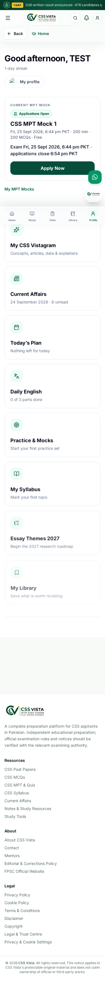 |
| Application screen | 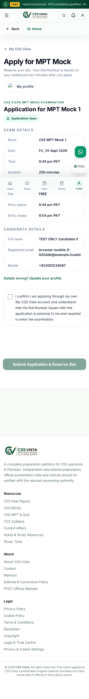 |
| Confirmation and Roll Number countdown | 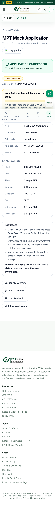 |
| Roll Number revealed | 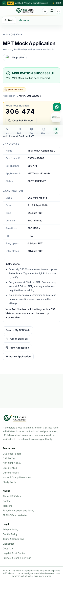 |
| Candidate verified (late start) | 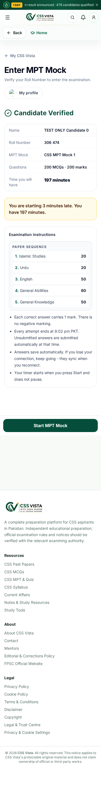 |
| Exam (timer, save status, navigation) | 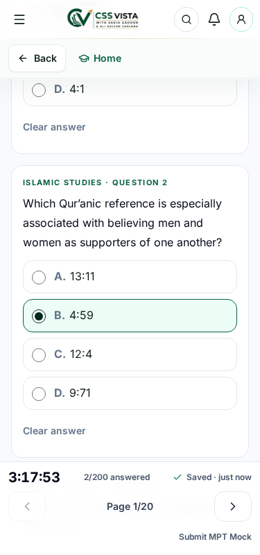 |
| Result | 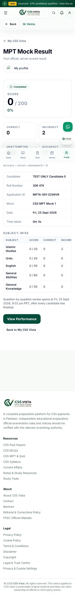 |
| History | 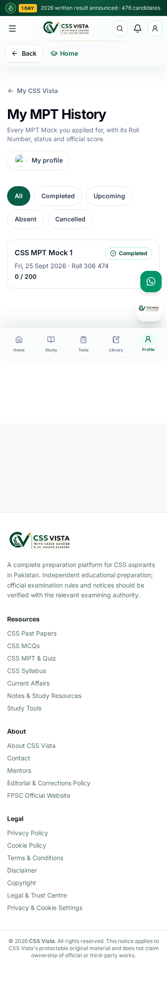 |
| Performance | 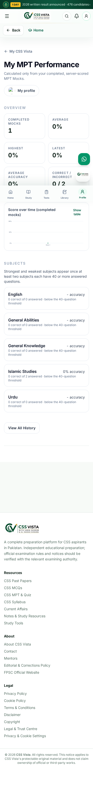 |
| Public page, logged-out Apply | 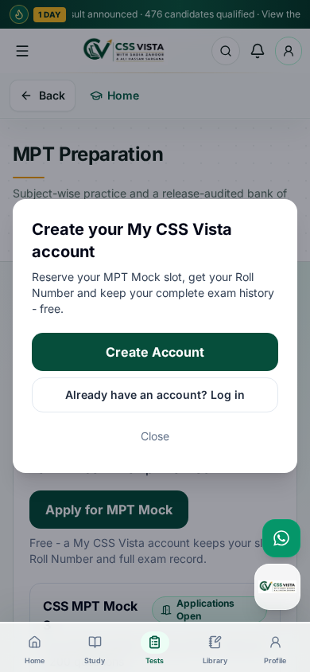 |
| Desktop: Roll Number | 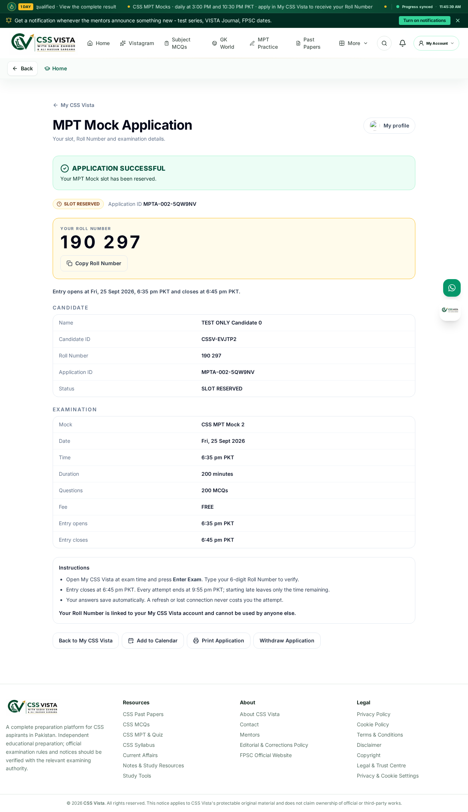 |
| Desktop: exam | 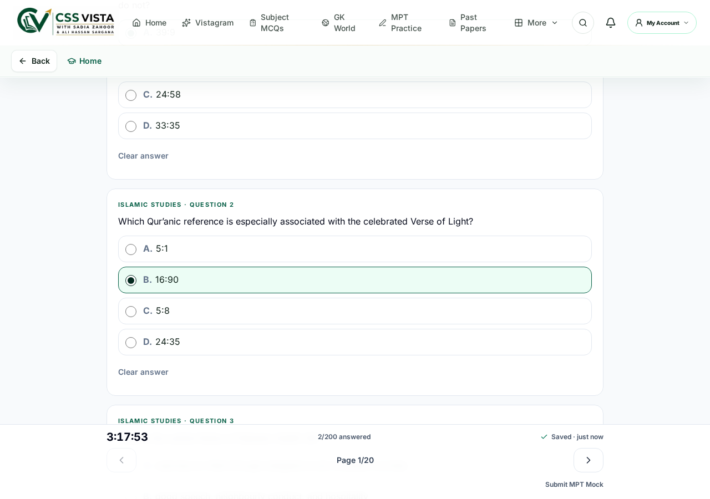 |
| Desktop: result | 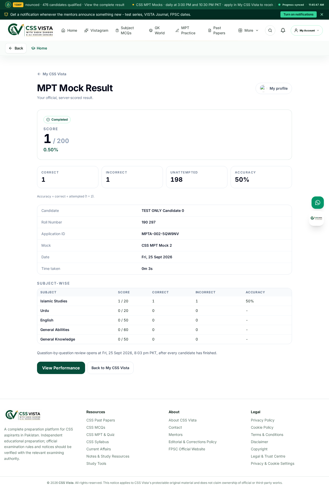 |

## Not yet verified — needs the owner or production

- **Hostinger production.** Nothing has been deployed. Setting `CSSV_MPT_PAPER_SEED`,
  the cron job and the pilot flag, then a pilot mock on the live site (RUNBOOK §1), is
  the remaining acceptance step. So is a Lighthouse before/after on `/mpt` and `/` on the
  live site: prerendered HTML is unchanged, and all new code is lazy-loaded behind routes
  and the flag.
- **Offline for two minutes, and expiry while offline.** The client keeps an offline
  queue in `localStorage`, and the server sweeper submits saved answers. Both parts are
  tested separately; a throttled-network browser run was not scripted.
- **Screen readers and WCAG 2.1 AA.** The work follows AA patterns:
  - labelled inputs, `aria-describedby` errors, and focus moved to errors and headings;
  - polite timer announcements at 30/15/10/5/1 minutes;
  - badges carry icon + text;
  - keyboard radios, 44 px targets, validated chart colours and a table view.

  No automated axe audit or manual NVDA/VoiceOver pass has been run. One is recommended
  before switching the flag fully on.
